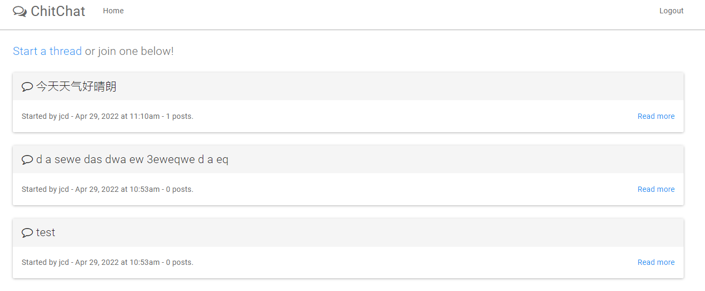

# go语言web编程入门
**该教程的核心内容不是原创的**， 应该算是[《Go Web Programming》](https://www.amazon.com/Web-Programming-Sau-Sheong-Chang/dp/1617292567/ref=sr_1_1?keywords=go+web+programming&qid=1651213184&sprefix=go+web%2Caps%2C641&sr=8-1)的拾粹版， 针对的是有一定的go语言基础的开发人员。

## 教程目标
学习使用go的原生库的基本使用方法(无任何第三方依赖)， 最终能够完成一个聊天室MVC(model-view-controller)项目(创建话题， 讨论话题)， 这些库包括
   - net/http: 开启服务， 处理网络请求
   - html/template ：构建视图
   - database/sql： 操作数据库

最终呈现的效果会类似于：

 

 ## 目录
 - [HelloWorld](./helloworld.md)
 - [Request & Response](./request_and_response.md)
 - [Cookie](./cookie.md)
 - [Template](./template.md)
 - Database
 - ChitChat(项目开发)