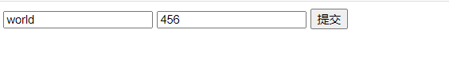

# Request & ResponseWriter

作为Handel Function的两个重要参数， 下面我们会详细介绍一下这两个对象。

## Request

一个标准的HttpRequest通常会有以下几个组成部分：

- URL
- Header
- Body
- Form, PostForm, MultipatForm

### URL

再go中URL的结构体如下：

```go
type URL struct {
	 Scheme string
	 Opaque string
	 User *Userinfo
	 Host string
	 Path string
	 RawQuery string
	 Fragment string
}
```

一般的格式为：

**scheme://[userinfo@]host/path[?query][#fragment]**

以URL:  [http://www.example.com/post?id=123&thread_id=456](http://www.example.com/post?id=123&thread_id=456) 为例：

它的scheme为http; host为[www.example.com](http://www.example.com/post?id=123&thread_id=456)； path为post; [?id=123&thread_id=456](http://www.example.com/post?id=123&thread_id=456) 则是RawQuery部分， 通常我们可以通过Request对象的Form字段便利的解析好的键值对。

### Header

请求头Header再数据结构上是下面这样的：

```go
type Header map[string][]string
```

你可以使用如下的方法获取Header中的属性：

```go
// 注意这里下面的r为http.Request对象
// 使用[]的方式获取
h := r.Header["Accept-Encoding"]

// 或者使Get方法
r.Header.Get("Accept-Encoding")
```

但是需要注意的是， 上面你的两种方式返回的结果有非常细微的区别，前者由于直接获取的是Header字典对象的值， 所以它的返回值是一个列表(参考前面的定义)， 后面的会返回字符串

### Body

首先我们来看一下Request结构体中对于Body的定义：

```
type Request struct {
    ...
    Body io.ReadCloser
    ...
}
```

它实际上是一个io.ReadCloser接口， 从这个接口的命名上我们也可以知道它具有Read和Close方法， 那么我们可以通过如下方式获取Request.Body的数据

```go
package main

import (
	"fmt"
	"net/http"
)

func body(w http.ResponseWriter, r *http.Request) {
		len := r.ContentLength
		body := make([]byte, len)
		r.Body.Read(body)
		fmt.Fprintln(w, string(body))
}

func main() {
		server := http.Server{
			Addr: "127.0.0.1:8080",
		}
		http.HandleFunc("/body", body)
		server.ListenAndServe()
}
```

使用以下命令发起Post请求的话：

```bash
curl -id "a=1&b=2" 127.0.0.1:8080/body
```

可以得到类似下面的结果

```
HTTP/1.1 200 OK
Date: Tue, 13 Jan 2015 16:11:58 GMT
Content-Length: 37
Content-Type: text/plain; charset=utf-8

a=1&b=2
```

也就是Request.Body中包含了我们的查询字符串(a=1&b=2)， 虽然可以自己编写解析代码获取其中的查询键值对， 但是在真是开发场景中， 我们通常会通过别的方式来获取查询字符串，也就是后面要提到的Form字段

### Form

HTML表单元素通常会具有多种编码类型(enctype):

- application/x-www-form-urlencoded（默认类型）
- multipart/form-data
- text/plain

如果采用默认的编码方式， 那么表单中的输入会编码为类似下面的格式:

```bash
key1=value1&key2=value2
```

如果你换一种方式， 比如multipart/form-data， 编码结果会有很大的不同， 通常来说multipart/form-data适合上传文件时使用， 其他情况使用默认的编码形式就可以了

在web开发中， 获取用户的request中的查询键值对，是非常常见且必要的， 那么该如何获取呢？

作为示例， 首先我们需要准备一个包含样例表单的Form的Html文件：

```html
<html>
  <head>    
    <meta http-equiv="Content-Type" content="text/html; charset=utf-8" />
    <title>Go Web Programming</title>
  </head>
  <body>
    <form action="http://127.0.0.1:8080/process?hello=world&thread=123" method="post" enctype="application/x-www-form-urlencoded">
      <input type="text" name="hello" value="world"/>
      <input type="text" name="post" value="456"/>
      <input type="submit"/>
    </form>
  </body>
</html>
   
```

它在浏览器上的效果如下：



同时准备好我们的服务端代码：

```go
package main

import (
 "fmt"
 "net/http"
)

func process(w http.ResponseWriter, r *http.Request) {
	 r.ParseForm()
	 fmt.Fprintln(w, r.Form)
}

func main() {
	 server := http.Server{
	 Addr: "127.0.0.1:8080",
	 }
	 http.HandleFunc("/process", process)
	 server.ListenAndServe()
}
```

重要的代码其实就是下面的两句：

```go
r.ParseForm()
fmt.Fprintln(w, r.Form)
```

<aside>
💡 Form本质上是一个map[string][]string(和前面的Header一样)， 所以你可以使用上面操作Header的方法([]获取Get)来获取某个键的值。

</aside>

运行上面的代码， 接着我们在浏览器点击’提交’会得到如下结果:

```
map[hello:[world world] post:[456] thread:[123]]
```

仔细看hello里出现了两个world, 同时还有一个表单中不具有的thread的键值对！

其实， Form字段不仅包含了我们肉眼能看到的两个表单值， 同时还包括了写在form中的action URL中的查询键值(你看一下上面的form表单定义就知道了)。 那么如果我只想要得到我们肉眼能看到的两个表单值而忽略通过action提交的键值该怎么办， 很简单把上面的r.Form改成r.PostForm即可。

如果我们的表单的enctype是multipart/form-data, 那我们就不能在使用ParseForm来解析对象了， 而是需要采取下面的方法：

```go
  r.ParseMultipartForm(1024) //需要读取的字节长度
	fmt.Fprintln(w, r.MultipartForm)
```

再次提交表单， 得到的结果如下：

```go
&{map[hello:[world] post:[456]] map[]}
```

这个结果的不同点在于， 首先， **它返回没有返回action url中的键值对**， 然后他的第二个map是一个空的字典对象

另外我不想取得整个Form对象， 而只是其中的某个键值， 该怎么办呢， 可以调用如下方法：

```go
r.FormValue("hello") // 它会返回Form的hello的第一个值

//或者
r.PostFormValue("hello")
```

最后需要指出的是multipart/form-data这种编码形式最常用在上传文件上， 我们修改以下我们的html中的表单：

```html
<html>
  <head>    
    <meta http-equiv="Content-Type" content="text/html; charset=utf-8" />
    <title>Go Web Programming</title>
  </head>
  <body>
    <form action="http://localhost:8080/process" method="post" enctype="multipart/form-data">
      <input type="file" name="uploaded">
      <input type="submit">
    </form>
  </body>
</html>
```

然后修改一下是我们的服务端代码：

```go
package main

import (
	"fmt"
	"io/ioutil"
	"net/http"
)

func process(w http.ResponseWriter, r *http.Request) {
	file, _, err := r.FormFile("uploaded")  // 第二个返回值是*multipart.FileHeader， 这里可以忽略
	if err == nil {
		data, err := ioutil.ReadAll(file)
		if err == nil {
			fmt.Fprintln(w, string(data))
		}
	}
}

func main() {
	server := http.Server{
		Addr: "127.0.0.1:8080",
	}
	http.HandleFunc("/process", process)
	server.ListenAndServe()
}
```

只要调用r.FormFile就能拿到我们上传的数据， 就是如此简单！

## ResponseWriter

ResponseWriter有3个方法， 分别是

- Write
- WriteHeader
- Header

### Write

Write方法会接收一个[]byte类型的参数， 如下所示

```go
func writeExample(w http.ResponseWriter, r *http.Request) {
	 str := `
        Hello World
	</html>`
	 w.Write([]byte(str))
}
```

### WrtieHeader

注意， WriteHeader只能写接受int类型的参数， 比如200， 301之类的状态码:

```go
func writeHeaderExample(w http.ResponseWriter, r *http.Request) {
   w.WriteHeader(200)
	 w.Write([]byte(str))
}
```

### Header

Header方法才是真正设置响应头的方法:

```go
func headerExample(w http.ResponseWriter, r *http.Request) {
	 w.Header().Set("Location", "http://google.com")
	 w.WriteHeader(302)
}
```

上面演示了一个跳转流程， 注意这里的代码顺序， 先要设置响应头中的Location值到目标URL, 然后才是通过WriteHeader写入状态码(302， 临时跳转)

### 返回Json结果

```go
func jsonExample(w http.ResponseWriter, r *http.Request) {
	 w.Header().Set("Content-Type", "application/json")
		 post := &Post{
		 User: "tommy",
	 }
	 json, _ := json.Marshal(post)
	 w.Write(json)
}
```

由于返回结果是json类型， 所以推荐将响应头中的Content-Type设置为application/json的形式， 当然这个并不是说是必须的。