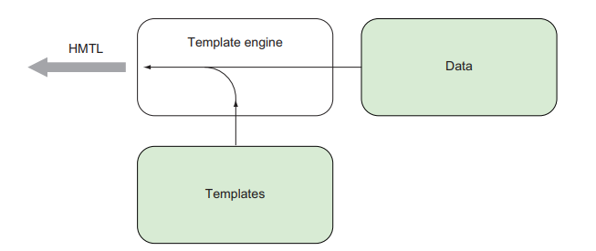
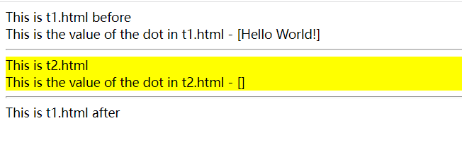
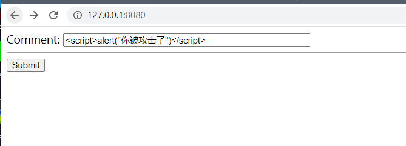

# Template

MVC(Model–view–controlle)曾经是一种非常流行的web设计模式(现在多半会是前后段分离的模式)， 其中比较由代表性的， 比如Ruby的Ruby On Rails， 还有python的Django.

MVC中的V就是我们常说的视图部分， 在支持MVC的框架中, 视图通常会由一个模板引擎来构建。模板引擎， 会把数据融汇到网页的静态资源(比如HTML)中， 这样使用户看的视图具备有基于数据动态可变的特性：



## 简单的例子

首先我们准备一个简单发html文件(helloworld.html):

```go
<!DOCTYPE html>
<html>
  <head>
    <meta http-equiv="Content-Type" content="text/html; charset=utf-8">
    <title>Hello world</title>
  </head>
  <body>
    {{ . }}
  </body>
</html>
```

服务端代码（同目录下， 命名为main.go）:

```go
package main

import (
	"html/template"
	"net/http"
)

func helloWorld(w http.ResponseWriter, r *http.Request) {
	t, _ := template.ParseFiles("tmpl.html")
	t.Execute(w, "Hello World!")
}

func main() {
	server := http.Server{
		Addr: "127.0.0.1:8080",
	}
	http.HandleFunc("/helloworld", helloWorld)
	server.ListenAndServe()
}

```

运行 go run main.go 我们可以在http://127.0.0.1:8080/helloworld获得”Hello World!“的文本字符串。

我们handler被命名为helloWorld，  它做了下面两件事:

- 通过template.ParseFiles()指定需要解析的html文件， 他会返回一个Template类型和一个err;

 你不想要处理这个err可以使用Must方法

```go
t := template.Must(template.ParseFiles("tmpl.html"))
```

- 对返回的Template对象调用Execute， 把数据传入到我们模板中:

```go
t.Execute(w, "Hello World!")
```

这里的数据就是“Hello World”， 当然除了字符串类型， 也可以是任意其他的go类型。

传入的“Hello World!”最终会替换到html文件中的{{.}}的部分。

<aside>
💡 ParseFiles函数可以同时传入多个模板文件， 但是在执行Execute的时候， 数据只会被导入到第一个模板文件； 除非通过ExecuteTemple的第二个参数指定具体的文件

</aside>

## 模板指令

仅仅把数据导入到模板是不够的， 我们希望通过更多的指令来完成一些更有意思的操作。

这些指令包括:

- if指令
- range指令
- with指令
- template指令
- define指令
- block指令

### if指令

单一条件的情况

```html
{{if condition}}
    some content
{{end}}

```

注意上面的condtion是一个布尔值,.

多个条件的情况

```html
{{ if condition }}
 some content
{{ else }}
 other content
{{ end }}
```

### range指令

```html
{{range array}}
    每个项目itme的值为 {{.}}
{{end}}
```

这个指令通常可以和表单一起是使用：

```html
<ul>
{{range .}}
    <li>{{.}}</li>
{{else}}
     <li>nothing</li>
</ul>
```

注意上面的{{else}}， 当没有任何数组传入的时候， 会执行else中定义的操作

### with指令

```html
{{ with arg }}
     Dot is set to arg
{{ else }}
     Fallback if arg is empty
{{ end }}
```

在with语句块中的所有{{.}}将会被替换为arg， 如果arg为空， 则会渲染else部分的代码。 当然设置指令只能覆盖with和end之间的{{.}}， end之外的内容不受影响

### Template指令

template指令的目的在于在一个模板引入其它的模板， 思考一下页面的Header， Footer或者是侧边栏通常是通用的；因而并不需要在多个页面重复编写， 只要在需要的时候引入即可。下面是一个例子：

首先， 我们准备一个t1.html

```html
<!DOCTYPE html>
<html lang="en">
  <head>
    <meta charset="utf-8">
    <meta http-equiv="X-UA-Compatible" content="IE=9">
    <title>Go Web Programming</title>
  </head>
  <body>    
    <div> This is t1.html before</div>
    <div>This is the value of the dot in t1.html - [{{ . }}]</div>
    <hr/>
    {{ template "t2.html" }}
    <hr/>
    <div> This is t1.html after</div>
  </body>
</html>
```

这里我们使用了{{template “t2.html”}}把t2.html引入到了t1.html中。

然后， 编写需要被引入的t2.html：

```html
<!DOCTYPE html>
<html lang="en">
  <head>
    <meta charset="utf-8">
    <meta http-equiv="X-UA-Compatible" content="IE=9">
    <title>Hello World</title>
  </head>
  <body>    
    <div> This is t1.html before</div>
    <div>This is the value of the dot in t1.html - [{{ . }}]</div>
    <hr/>
    {{ template "t2.html" }}
    <hr/>
    <div> This is t1.html after</div>
  </body>
</html>
```

然后我们在同一目录， 编写一下我们的服务端代码main.go

```go
package main

import (
	"html/template"
	"net/http"
)

func process(w http.ResponseWriter, r *http.Request) {
	t, _ := template.ParseFiles("t1.html", "t2.html")
	t.Execute(w, "Hello World!")
}

func main() {
	server := http.Server{
		Addr: "127.0.0.1:8080",
	}
	http.HandleFunc("/process", process)
	server.ListenAndServe()
}
```

这里， 我们t1.html和t2.html都加入到了tempalte.ParseFiles中；

运行 go run main.go， 我们看到如下页面：



可以看到， t2.html成功的嵌入到了t1.html中！

### define指令

前面我们使用{{tempalte html文件名 .}}的方式来引入一个模板， 这里的问题在于， 模板和文件名是绑定的， 假设我要同时引入多个部分呢？ 比如我同时要引入一个页眉和页脚怎么办， 按照前面的方法我得准备两个模板文件， 但是如果有更多的公有部分呢， 显然这种凡是不适合扩展， 相反我们可以使用define指令在一个文件中编写多个模板， 如下：

```html
{{ define "模板一" }}
<html>
 <head>
 <meta http-equiv="Content-Type" content="text/html; charset=utf-8">
 <title>Go Web Programming</title>
 </head>
 <body>
 {{ template "模板二" }}
 </body>
</html>
{{ end }}
{{ define "模板二" }}
Hello World!
{{ end }}
```

通过define指令我们可以在一个文件中编写多个模板， 他们也都可以通过tempalte进行引用！

### block指令

block指令的作用是提供一个默认模板：

```html
{{ block "content" . }}
 <h1 style="color: blue;">Hello World!</h1>
 {{ end }}
```

假设在外部没有传入一个名为content的模板(通过template.ParseFile函数)， 那么block中的html将会被渲染。

### 变量、 管道及自定义函数

### 变量

```html
{{ range $key, $value := . }}
 The key is {{ $key }} and the value is {{ $value }}
{{ end }}
```

使用**&变量=值**的形式可以将值赋值给变量， 比如上面便利map对象的一个例子， 通过**{{ range $key, $value := . }}**遍历了一个字典对象， 分别取出了它的键和值

### 管道

定义管道的方式如下：

```html
{{p1|p2|p3}}
```

上面的代码其实等价于： p3(p2(p1)),  也就是前面的值会是后者的后续参数， 比如:

```html
{{12.34567|printf "%.2f"}}
```

等价于printf(“%.2f”， 12.34567), 这里的printf是模板自带的函数。更多的自带函数参考下面： 

[template](https://pkg.go.dev/text/template#hdr-Functions)

下面会介绍自定义函数的定义方法

### 自定义函数

自定义函数的返回值数量只能是1个或两个， 两个的情况， 第二个必须是一个err。

下面是自定义函数的演示:

```go
func process(w http.ResponseWriter, r *http.Request) {
		 funcMap := template.FuncMap{ "fdate": formatDate }
		 t := template.New("tmpl.html").Funcs(funcMap)
		 t, _ = t.ParseFiles("tmpl.html")
		 t.Execute(w, time.Now())
}
```

首先我们需要提供一个函数名称(会被模板识别)对应函数（需要另外定义好）的字典（这里的FuncMap）, 在模板中， 键会是值的别名。

接着， 我们通过.Funcs(funcMap)来注册我们的自定义函数了。 

在使用的时候， 我们通常会采用前面提到的管道形式：

```html
{{.|fdate}}
```

或者直接是：

```html
{{fdate .}}
```

## 嵌入原生HTML

go的template会将输入到模板的html文本自动转义成不带html语义的文本， 这样的好处在于， 可以在很大程度上避免XSS攻击。

考虑一个用户在论坛评论的场景， 假设用户输入了一段带有<script></script>的评论， 如果不对改评论进行转义， 那么网页在渲染的时候就会运行script中的代码。

为了演示这个例子， 首先我们能需要准备好一个form.html用来接收用户的输入：

```html
<html>
  <head>
    <meta http-equiv="Content-Type" content="text/html; charset=utf-8">
  </head>
  <body>
    <form action="/process" method="post">
      Comment: <input name="comment" type="text" size="50">
     <hr/>
     <button id="submit">Submit</button>
    </form>
  </body>
</html>
```

接着是表单提交的目标页的html代码(temp.html)：

```html
<html>
  <head>
    <meta http-equiv="Content-Type" content="text/html; charset=utf-8">
    <title>Go Web Programming</title>
  </head>
  <body>
    <div>{{ . }}</div>
  </body>
</html>
```

最后是服务端代码：

```go
package main

import (
 "net/http"
 "html/template"
)
func process(w http.ResponseWriter, r *http.Request) {
	 t, _ := template.ParseFiles("tmpl.html")
	 t.Execute(w, r.FormValue("comment"))
}

func form(w http.ResponseWriter, r *http.Request) {
	 t, _ := template.ParseFiles("form.html")
	 t.Execute(w, nil)
}

func main() {
 server := http.Server{
		 Addr: "127.0.0.1:8080",
 }

 http.HandleFunc("/process", process)
 http.HandleFunc("/form", form)
 server.ListenAndServe()
}
```

当你运行这段代码， 然后在网页http://127.0.0.1:8080输入一段带script标签的内容， 如下：



点击提交， 你会发现alert(”你被攻击了“)这段代码没有执行， 原因在于他被go识别并转义了！

如果你查看网页源代码的话， 你会发现原来的html文件被转义成了下面这个样子：

```html
<html>
  <head>
    <meta http-equiv="Content-Type" content="text/html; charset=utf-8">
    <title>Go Web Programming</title>
  </head>
  <body>
    <div>&lt;script&gt;alert(&#34;你被攻击了&#34;)&lt;/script&gt;</div>
  </body>
</html>
```

当然有时候你确实需要允许输入html的话(虽然不推荐这么做), 你可以进行如下操作：

```go
func process(w http.ResponseWriter, r *http.Request) {
		w.Header().Set("X-XSS-Protection", "0")
		t, _ := template.ParseFiles("tmpl.html")
		t.Execute(w, template.HTML(r.FormValue("comment")))
}
```

只要对想要避免转义的内容使用template.HTML即可， 然后重新启动刚才的脚本， 你会看到alert(”你被攻击了“)被成功执行了